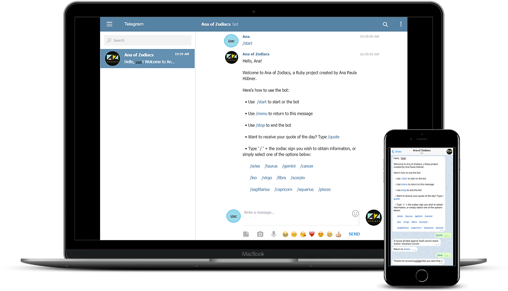

# Ruby-CapstoneProject

This is a solo project to finish Microverse's **Ruby** section that consists of implementing a **[Telegram](https://en.wikipedia.org/wiki/Telegram_(software)) bot**.

### Screenshot:

## About the project

The goal of the project is to use all the experience acquired in the Ruby Curriculum to set up the basic elements for the bot.

## Prerequisites

To run the bot, you need a personal **Telegram account** and **Ruby** installed in your machine.

## Installation and Execution

  1. Download/clone this repository [GitHub Repository](https://github.com/anapdh/Ruby-CapstoneProject) on your computer.
  2. In your terminal, use the command `cd` to go to the place where you have saved/cloned the repository. For example: _Desktop/User/Ruby-CapstoneProject/_. You may use the command `ls` to see the files and repositories existent in your current location.
  3. Now, use the command `cd bin` again to enter the folder and execute `ruby main.rb` in the terminal to start running the bot.
If the bot starts running successfully, you'll see the message "Hello there... The bot is running!" in the terminal.

## How to use the bot

  1. After making sure that the bot is running, you'll need to access the [Telegram Web](https://web.telegram.org/#/im?p=@AnaOfZodiacs_bot). This link redirects automatically to the bot page. If you want to access from your device (Telegram App), you can search for Ana of Zodiacs in the chats menu.
  2. The bot will request for you to start. Let's start!
  3. Simply follow to commands to access the bot features or return to the main menu:

      Here's how to use the bot:

      • Use  /start to start or the bot

      • Use /menu to return to this message

      • Use /stop to end the bot

      • Want to receive your quote of the day? Type /quote

      • Type ' / ' + the zodiac sign you wish to obtain information, or simply select one of the options below:

          /aries    /taurus    /gemini    /cancer

          /leo    /virgo    /libra    /scorpio

          /sagittarius    /capricorn    /aquarius    /pisces

  4. After you are done with the bot, simply close the 'bot conversation' and press Ctrl + Z in your terminal to stop running the bot.

## Author

👩🏼‍💻 **Ana Paula Hübner**

- GitHub: [@anapdh](https://github.com/anapdh)
- Twitter: [@anapdh](https://twitter.com/anapdh)
- LinkedIn: [LinkedIn](https://www.linkedin.com/in/ana-paula-hübner-7a9484181)

## 🤝 Contributing

Contributions, issues, and feature requests are welcome!

Feel free to check the [issues page](https://github.com/anapdh/Ruby-CapstoneProject/issues).

## Show your support

Give a ⭐️ if you like this project!

## 📝 License

This project is [MIT](./LICENSE) licensed.